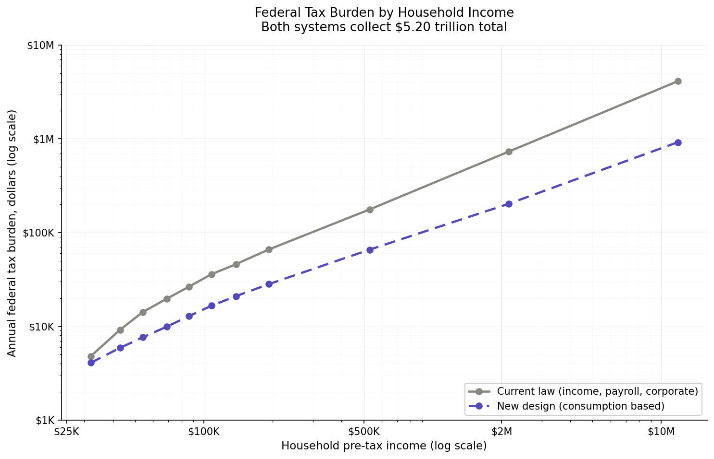
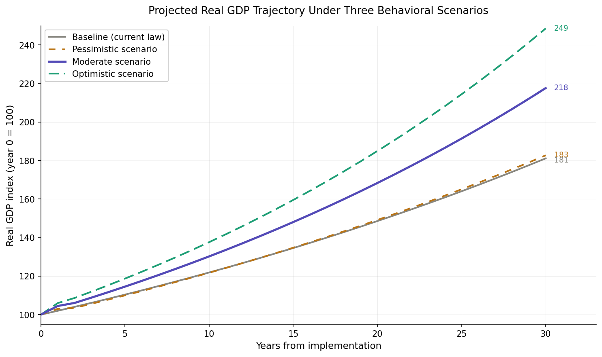

# The Paycheck Restoration Act

*Replacing Individual Income, Payroll, and Corporate Income Taxes*

A Policy Analysis and Distributional Model

Prepared 2026

## 1. Across-the-Board Individual Savings

Under the Paycheck Restoration Act, every household income level pays less in annual federal taxes than under current law, while the federal government collects the same total revenue of $5.20 trillion. This is not an optical illusion; it is the result of three structural shifts that bring previously untaxed economic activity into the tax base. Those three shifts (capture of the shadow economy, a broader tax base on business transactions, and a new tax on foreign investment returns) together generate roughly $1 trillion in revenue that current income, payroll, and corporate taxes cannot reach.

The chart below compares the actual annual federal tax burden borne by households at each income level under both systems. The gray solid line represents current law (the combined burden of individual income tax, payroll tax, corporate income tax incidence, tariffs, excise taxes, and estate tax). The purple dashed line represents the new design (consumption tax incidence plus retained tariffs, excise, estate tax, short-term capital gains, foreign investment return tax, and Federal Reserve remittances). Both axes are logarithmic to show the full income spectrum from working class to ultra-wealthy.

The bottom decile (households earning under $20,000 in true income) is essentially neutral between the two systems. Both produce a small net subsidy through Earned Income Tax Credit and Child Tax Credit payments. From the second decile upward, the new design produces meaningful annual savings that grow with income.

### Key savings by income level

| **Household income** | **Current law burden** | **New design burden** | **Annual savings** | **% reduction** |
|----------------------|------------------------|-----------------------|--------------------|-----------------|
| $50,000             | $10,260               | $5,055               | **$5,205**        | 51%             |
| $75,000             | $17,975               | $8,150               | **$9,825**        | 55%             |
| $100,000            | $28,250               | $11,395              | **$16,855**       | 60%             |
| $150,000            | $47,250               | $16,150              | **$31,100**       | 66%             |
| $200,000            | $62,600               | $20,380              | **$42,220**       | 67%             |
| $500,000            | $176,500              | $46,950              | **$129,550**      | 73%             |
| $1,000,000          | $361,000              | $92,320              | **$268,680**      | 74%             |
| $5,000,000          | $1,930,000            | $489,300             | **$1,440,700**    | 75%             |
| $25,000,000         | $10,680,000           | $1,822,200           | **$8,857,800**    | 83%             |

Notes on methodology: Current law burden uses standard economic incidence assumptions from Congressional Budget Office distributional analyses. Workers bear roughly half of corporate income tax through reduced wage growth, and they bear the full economic incidence of payroll tax including the employer half. New design burden includes direct consumption tax on household purchases plus the worker, capital, and consumer incidence of business-side consumption taxes (B2B services, capital expenditures, real estate transactions, construction, used vehicles, and business fuel).

## 2. The Uncaptured Shadow Economy

The United States has a shadow economy estimated by academic researchers (notably Friedrich Schneider at Johannes Kepler University and Colin Williams at the University of Sheffield) at roughly 8 to 10 percent of gross domestic product. In current dollar terms, this represents approximately $2.5 trillion of annual economic activity that does not appear in any income tax filing. Under current law, federal tax revenue from this $2.5 trillion is essentially zero.

The shadow economy is not exotic. It includes activities that are everywhere visible:

- Cash businesses where receipts are not fully reported, including small-volume restaurants, beauty salons, mobile food vendors, lawn care, house cleaning, and child care.

- Tipped wages where reported tips fall short of actual tips received.

- Off-the-books contracting in residential construction, home repair, painting, roofing, and other trades.

- Gig economy income that workers do not report or report incompletely, including online platform earnings, freelance services, and informal trades.

- Drug trade at the retail level, estimated at $150 to $200 billion annually.

- Undocumented immigrant labor paid in cash, estimated at $200 to $300 billion annually.

- Theft and fraud proceeds spent in the formal economy.

- Illegal gambling and adult industry receipts.

- Counterfeit goods and smuggled merchandise.

This activity has one consistent feature: the people earning the income spend a large portion of it on goods and services in the formal economy. Drug dealers buy cars, restaurant meals, electronics, and houses. Off-the-books contractors buy groceries, gasoline, and home appliances. Undocumented workers buy household supplies and pay rent. The cash flows into the formal economy at the point of consumption.

Under current law, these flows reach the formal economy without ever passing through the tax system. The cash that bought a $35,000 truck from a shadow earner pays no payroll tax, no income tax, no corporate tax. The dealer reports the sale (so it appears in macro Bureau of Economic Analysis consumption data) but the buyer never appears in any Internal Revenue Service file. This is a permanent gap in current federal tax architecture.

Under the Paycheck Restoration Act, this gap closes. When the shadow earner buys a $35,000 truck at a dealership, the dealership collects the consumption tax at point of sale and remits it to the state, which remits it to the federal government. The buyer does not need to file anything. The dealer collects regardless of how the buyer earned the money. The system is enforcement-blind to income source.

### Estimated annual revenue from shadow economy capture

Approximately 95 percent of shadow economy income is consumed (the savings rate among shadow earners is low because they cannot easily deposit large cash balances without triggering bank reporting). Of that consumption, about 70 percent falls in taxable categories (cars, appliances, restaurant meals, gasoline, telecommunications, electronics, clothing, entertainment) rather than in exempt categories (rent, groceries, healthcare). At a 25.1 percent consumption tax rate, the expected federal revenue from shadow economy capture is:

$2.5 trillion shadow income x 95% consumed x 70% taxable share x 25.1% rate = approximately $420 billion in annual federal tax revenue.

This is roughly 8 percent of total federal collections. It is comparable in magnitude to the entire current corporate income tax. It comes from people and activities that pay essentially zero federal tax under current law.

### Why this matters for distributional analysis

Standard distributional analysis using reported income as the denominator tends to overstate the regressive nature of consumption taxes. The bottom decile reports an average income of about $16,000 but actually consumes about $28,000, with the gap funded by a mix of transfers, savings drawdowns, family support, and (importantly) unreported income. When the shadow income is properly counted, the effective consumption tax rate as a percentage of true income is much lower than it appears against reported income alone.

This is the core reason every income decile pays less under the new design while total revenue stays the same: the design captures economic activity that current law cannot reach, allowing a lower rate that still raises the same revenue.

## 3. High Earner Avoidance of Income Tax

Income tax has never been a reliable instrument for collecting revenue from very high earners. The history of high marginal rates in the United States demonstrates this pattern with unusual clarity. When statutory rates rise, reported income at the top falls. The income does not disappear; the form of compensation changes.

### The 91 percent rate era and what it actually collected

From 1944 through 1963, the top federal marginal income tax rate exceeded 90 percent. From 1951 through 1963 it was 91 percent under the Eisenhower and early Kennedy administrations. A common assumption is that this produced enormous federal revenue from the wealthy. It did not. The effective rate paid by the top 1 percent during this period averaged roughly 42 percent according to research by economists Thomas Piketty and Emmanuel Saez. The gap between the 91 percent statutory rate and the 42 percent effective rate represents avoidance, not compliance.

The avoidance mechanisms of that era reshaped American corporate life in ways still visible today:

- Corporate-owned executive housing. Companies bought condominiums, vacation homes, and country estates for their executives. The executive used them tax-free; the company depreciated them as business assets.

- Corporate transportation. Company cars, drivers, and (for top executives) corporate aircraft moved out of personal income and into business expense.

- Corporate club memberships. Country clubs, athletic clubs, and luncheon clubs were paid by corporations as business development expense rather than as personal compensation.

- Deferred compensation arrangements. Pensions, deferred annuities, and golden-handcuff structures shifted compensation outside the years of peak income tax rates.

- Family employment. Spouses and adult children appeared on corporate payrolls as consultants or directors, splitting income across multiple lower-rate brackets.

- In-kind benefits. Personal use of corporate facilities, expense accounts treated as personal income substitutes, and entertainment budgets used for personal purposes.

When marginal rates fell after the 1964 tax cut and again after 1981 and 1986, much of this in-kind compensation moved back to cash. Reported top-bracket income surged not because the wealthy were earning more but because they no longer needed to disguise their compensation.

### The continuing arms race

Tax law and tax planning have been in a continuous arms race for over a century. The Internal Revenue Service closes a loophole; tax planners open three new ones. Section 274 of the Internal Revenue Code disallowed entertainment deductions; planners moved to deferred compensation. Section 280F limited luxury vehicle deductions; planners moved to leased equipment. Section 132(j)(4) restricted on-premises athletic facilities; planners moved to wellness benefits and concierge medicine.

The most consequential modern shifts include:

- Stock options and restricted stock units. When the Tax Reform Act of 1986 cut top rates, much compensation flowed to cash. When rates rose in the 1990s, executives received compensation as incentive stock options and later as restricted stock units. The Silicon Valley pattern of executives paid one dollar in salary while making one hundred million dollars in option exercises is a direct result of differential tax treatment.

- Carried interest. Hedge fund and private equity managers receive performance compensation taxed as long-term capital gains rather than as ordinary income. Despite four presidential administrations promising to close this loophole, it survives and benefits a small number of managers by tens of billions of dollars annually.

- Pass-through restructuring. The Tax Cuts and Jobs Act of 2017 created a 20 percent deduction for qualified business income from pass-through entities. Within twelve months, accountants documented massive recharacterization of W-2 wages as pass-through income. Doctors, lawyers, consultants, and small business operators restructured their compensation.

- Corporate inversions and profit shifting. Large multinationals shift reported profits to low-tax jurisdictions through transfer pricing arrangements, intellectual property licensing, and Caribbean reinsurance structures.

The empirical literature on this responsiveness is unambiguous. The elasticity of taxable income, measured by Martin Feldstein and refined by Saez and others, ranges from 0.2 to 0.7 at the top of the distribution. This means that for every 1 percentage point increase in the marginal rate, reported taxable income at the top falls by 0.2 to 0.7 percent. This is one of the most robust empirical findings in modern public finance economics.

### Why consumption tax breaks the pattern

Consumption tax does not care how the wealthy structure their compensation. A corporate jet purchased for executive use is taxed when purchased. A second home is taxed when purchased. A luxury vehicle is taxed when registered. A private chef, a personal driver, a corporate club membership; all of these get taxed at point of consumption regardless of whether they appear on the executive's W-2 or on the corporation's expense ledger.

This eliminates the entire avoidance ecosystem. The compensation structuring industry, the tax shelter industry, the international profit-shifting industry; all become irrelevant. There is nothing to structure when the tax follows the spending.

The wealthy in the new design pay tax on their actual consumption. They pay much less than they would under a fully-enforced 91 percent rate (which has never existed in practice anyway). They pay slightly less than they pay today as effective rates on their reported income. But they pay this amount reliably, predictably, and without the ability to make it disappear through restructuring. From a revenue collection standpoint, predictability with moderate rates beats theoretical extraction with high rates that are routinely avoided.

## 4. Corporate Tax Reform: From Profit Tax to Consumption Tax

Current federal corporate income tax raises approximately $530 billion annually, about 10 percent of total federal revenue. The statutory rate is 21 percent following the 2017 Tax Cuts and Jobs Act, though effective rates for many large corporations are substantially lower due to deductions, credits, accelerated depreciation, and international structuring.

### Why corporate income tax fails as a revenue instrument

The corporate income tax has structural weaknesses that limit its effectiveness:

- Transfer pricing and profit shifting. Multinational corporations shift reported profits to low-tax jurisdictions like Ireland, the Netherlands, and the Cayman Islands. The Tax Foundation estimates that profit shifting reduces US corporate tax revenue by $50 to $100 billion annually.

- Deductible questionable expenses. Companies can deduct from taxable income a wide range of expenditures that have little to do with productive operations. Corporate jets, lavish offices, executive perks, charitable foundations controlled by founding families, and various other expenditures reduce taxable income while providing personal benefit to executives and owners.

- Net operating loss carryforwards. Companies that report losses can carry them forward to offset future taxes. This is sometimes legitimate; sometimes it represents accumulated tax shelters.

- Accelerated depreciation. Companies write off capital purchases faster than the actual economic life of the assets, reducing current-year taxable income.

- Credits for politically favored activities. Research and development, low-income housing, renewable energy, and various other categories receive tax credits that further reduce effective rates.

The result is a system where reported corporate profits are not the same as actual corporate value creation, and effective tax rates vary wildly across industries and individual firms. A profitable software company with substantial R&D activity may pay 5 percent. A profitable manufacturer may pay 18 percent. A real estate operator may pay zero or report a loss while distributing substantial cash to owners.

### The wheat and flour distinction

The proposed consumption tax design draws a clean economic distinction between two types of business expenditure that current corporate tax law treats identically:

If a flour mill buys wheat to grind into flour, the wheat is a production input. The wheat becomes flour. The flour gets sold. The value the mill adds is the grinding. Wheat is not consumption; it is production. The consumption tax does not apply to wheat purchases by the mill.

If the same flour mill buys a new grinding machine, the machine is a capital good consumed by the business in its operations. The machine depreciates over time, requires maintenance, and is eventually replaced. The mill is consuming the machine to add value to its production process. The consumption tax does apply to the machine purchase.

This distinction matters because under current corporate income tax, both purchases are treated identically. Both are deductible from taxable income. The mill pays no tax on either the wheat or the machine because both reduce reported profits. Under consumption tax, the wheat (a production input that becomes the product) flows through untaxed, while the machine (a consumed capital good) gets taxed.

### How current corporate tax incentivizes worker elimination

Current corporate income tax creates a powerful and largely invisible incentive for businesses to replace workers with equipment, even when the substitution does not improve output, quality, or genuine productivity. This bias against labor is built into the structure of how labor and capital are taxed differently, and it has consequences across the American workforce.

Consider a manufacturer evaluating a $500,000 piece of automation equipment that would replace four workers each earning $50,000 in wages plus benefits. Under current law, the analysis runs as follows:

- The $500,000 equipment purchase is fully deductible from corporate taxable income, often through immediate expensing under Section 179 or accelerated depreciation under bonus depreciation rules. At a 21 percent corporate rate, the federal government effectively subsidizes the equipment purchase by $105,000.

- The eliminated workers were costing the business $200,000 in wages plus approximately $15,300 in employer-side payroll tax. The payroll tax savings flow directly to the bottom line as $15,300 annually in perpetuity.

- Eliminated workers no longer require benefits administration, healthcare premiums (often 20 to 30 percent of wages), workers' compensation insurance, unemployment insurance contributions, or HR overhead. Total benefits-and-administration savings often exceed $50,000 annually.

- Eliminated workers no longer require regulatory compliance overhead: OSHA reporting, ACA compliance, EEO reporting, family leave administration, retirement plan administration, and various state-level employment compliance. These costs typically run $5,000 to $15,000 per employee annually.

- Eliminated workers may transition to government safety net programs (unemployment, food assistance, Medicaid, training programs). These costs shift to taxpayers rather than the business that displaced the workers.

The cumulative effect is that current law systematically subsidizes labor replacement. A business can replace workers with equipment that produces the same output and the same quality and still come out substantially ahead through pure tax and regulatory arbitrage. The displaced workers are not made more productive; they are simply moved out of the formal workforce.

Under the Paycheck Restoration Act, this incentive structure changes fundamentally. The same $500,000 equipment purchase now carries approximately $125,000 in consumption tax (at a 25.1 percent rate). There is no corporate income tax to deduct against. The eliminated payroll tax savings disappear because there is no payroll tax. The business still saves on benefits and regulatory overhead, but the magnitude of the saving is no longer subsidized by the federal tax system. The economic decision shifts toward neutral on tax grounds.

Where automation genuinely improves output or quality, businesses will still adopt it. That is appropriate. Where automation merely shifts the same output from human workers to machines without genuine improvement, the new design removes the artificial subsidy that drives the substitution. American workers compete on a more level playing field with the equipment that might replace them, because the equipment no longer arrives pre-subsidized through the corporate tax code.

### Equity between household and business consumption

Under the new design, businesses and households are treated identically for consumption tax purposes:

- A household buying a new washing machine pays consumption tax on the purchase.

- A laundry business buying a new commercial washing machine pays consumption tax on the purchase.

- A household buying a new vehicle pays consumption tax.

- A business buying a fleet vehicle pays consumption tax.

- A household buying lawn equipment pays consumption tax.

- A landscaping company buying lawn equipment pays consumption tax.

This eliminates a longstanding asymmetry. Under current law, a wealthy person operating through a corporation can buy a private jet, a luxury yacht, a Manhattan condominium, a country estate, an art collection, and a fleet of vehicles. All of these reduce corporate taxable income. An ordinary household making the same purchases pays full sales tax in their state. The tax system has historically given enormous advantage to consumption channeled through corporate structures rather than personal income.

### Revenue impact

Total business-side consumption tax revenue under the new design is approximately $2.59 trillion, distributed across:

| **Business consumption category**                           | **Tax base** | **Annual revenue** |
|-------------------------------------------------------------|--------------|--------------------|
| Business-to-business services (legal, consulting, software) | $2.50T      | $630B             |
| Capital equipment purchases                                 | $1.50T      | $377B             |
| Capital structures (commercial buildings)                   | $1.10T      | $276B             |
| New residential construction                                | $1.10T      | $276B             |
| Existing real estate transactions                           | $2.20T      | $552B             |
| Used vehicle dealer sales                                   | $0.70T      | $176B             |
| Business fuel and commercial transportation                 | $0.75T      | $188B             |
| Financial services fees, banking, investment management     | $0.30T      | $75B              |
| Other secondary markets                                     | $0.23T      | $58B              |
| **TOTAL business-side consumption tax**                     | **$10.38T** | **$2.59T**        |

Compared to current corporate income tax revenue of $530 billion, the business-side consumption tax raises nearly five times as much. The base is far larger because transactions exceed profits by a wide margin. Avoidance is far more difficult because the tax follows the transaction rather than the profit calculation.

The economic incidence of these business taxes is distributed across consumers (about 30 percent through prices), workers (about 50 percent through reduced wage growth), and capital owners (about 20 percent through reduced returns). This is the same incidence pattern that applies to current corporate income tax, but operating on a much larger and more reliable base.

## 5. Payroll Tax: The Hidden Burden on Working Americans

Payroll tax is the most regressive federal tax and falls hardest on working Americans, but most workers do not understand how heavily they actually pay. The combined federal payroll tax is 15.3 percent of wages, divided into 12.4 percent for Social Security (capped at $168,600 in 2024 wages) and 2.9 percent for Medicare (uncapped, with an additional 0.9 percent on high earners).

### The hidden half

By statute, the employer pays half of payroll tax (7.65 percent) and the employee pays the other half (7.65 percent). The employee sees only their half on the pay stub. This statutory split is an accounting fiction. Economic research has consistently shown that workers bear the full economic incidence of payroll tax, including the half labeled as the employer share. The mechanism is direct:

When an employer hires a worker, the employer calculates the total cost of employment. This includes the wage paid to the worker, the employer half of payroll tax, the cost of benefits, and other employment-related costs. The employer offers a wage that reflects what they can afford to pay after all of these costs. If the employer half of payroll tax did not exist, the employer would offer a higher wage. Workers have always earned the full pre-tax compensation; they just see only part of it.

Economic studies of this incidence pattern (notably Gruber 1997 on the elimination of employer payroll tax in Chile, Anderson and Meyer 1997 on the United States, and Saez, Schoefer, and Seim 2019 on Sweden) all confirm that workers bear essentially the full payroll tax burden regardless of statutory incidence. The wedge between what employers pay and what workers receive equals the full tax.

### How regressive payroll tax actually is

Payroll tax falls disproportionately on lower-income workers because:

- It applies only to wages, not to investment income, capital gains, dividends, or rental income. Wealthy households earning income from non-wage sources pay no payroll tax on those earnings.

- The Social Security portion is capped at $168,600 of wages. A worker earning $50,000 pays Social Security tax on 100 percent of their wages. A worker earning $1 million pays Social Security tax on 17 percent of their wages.

- Higher-income households tend to derive larger fractions of their compensation from non-wage sources (carried interest, equity, deferred compensation, partnership distributions) that escape payroll tax entirely.

The result is that a family earning $50,000 pays 15.3 percent of their true compensation in payroll tax, while a family earning $5 million may pay less than 1 percent of their true compensation in payroll tax. This is an extraordinarily regressive structure that operates almost invisibly because most workers do not understand their employer share is part of their compensation.

### Eliminating payroll tax under the new design

The proposed consumption tax design eliminates federal payroll tax entirely. Social Security and Medicare are funded from a dedicated carve-out within the consumption tax (approximately 5 percentage points of the total rate, generating roughly $1.0 trillion annually for these programs).

Eliminating payroll tax means every worker receives an effective raise of 15.3 percent of their gross wages, up to the Social Security wage base. This is the full payroll tax burden, both halves combined. The mechanism works in two parts. First, the employee no longer has 7.65 percent deducted from each paycheck for the visible half of payroll tax; this becomes immediate take-home pay. Second, the employer's hidden 7.65 percent contribution flows through to the worker as a statutory wage increase, raising the gross paycheck by the full amount the employer was previously paying to the government. The combined effect on take-home pay is the full 15.3 percent.

Without statutory controls, employers might pocket the eliminated employer half as profit and continue paying current wages. The employee would still benefit from the 7.65 percent reduction in deductions but would miss the additional 7.65 percent that rightfully belongs to them as part of their total compensation. With proper controls, every worker sees an immediate increase in take-home pay equal to the full 15.3 percent of their gross wages, up to the Social Security wage base, plus 2.9 percent on earnings above the wage base (representing the eliminated Medicare tax that has no wage cap).

### Statutory controls required

To ensure the elimination of payroll tax actually benefits workers rather than padding employer profit margins, the legislation must include enforceable provisions:

- Mandatory wage adjustment. Within 90 days of payroll tax elimination, every employer must increase each employee's base wage by an amount equal to the eliminated employer share (7.65 percent of wages up to $168,600, plus 1.45 percent on amounts above). Combined with the employee's eliminated deduction of 7.65 percent (plus 1.45 percent above the wage base), the worker's take-home pay rises by the full 15.3 percent up to the wage base, and 2.9 percent on earnings above.

- Documented compliance. Employers must report adjusted wages on Form W-2 with a clear notation of the payroll-tax-elimination wage adjustment.

- Department of Labor enforcement. Employers who fail to pass through the savings face penalties payable to affected workers, with the Wage and Hour Division of the Department of Labor having clear authority to investigate complaints.

- Three-year compliance audit. The Internal Revenue Service or its successor agency conducts compliance audits during the first three years to ensure broad pass-through across industries.

- Worker private right of action. Workers who do not receive the mandated wage adjustment have a private right of action to recover lost wages plus liquidated damages.

These controls are essential. Without them, the payroll tax elimination becomes a corporate windfall rather than a worker benefit. With them, every American worker receives an immediate, visible raise that they can see on their paycheck. For a worker earning $50,000, this represents an additional $7,650 in annual take-home pay (the full 15.3 percent). For a worker earning $80,000, this represents an additional $12,240 annually. For a worker earning $168,600 (the current Social Security wage base), this represents an additional $25,795. These are life-changing amounts for working families, and they appear in workers' paychecks immediately rather than as deferred or theoretical benefits.

## 6. Earned Income Tax Credit Reform and Consumption Exemptions

Two design features protect lower-income households under the new tax structure: a restructured Earned Income Tax Credit delivered quarterly rather than annually, and a thoughtful set of exemptions that remove the largest expenses of working families from the consumption tax base.

### EITC restructured for quarterly delivery

The current Earned Income Tax Credit and Child Tax Credit operate as lump-sum annual payments delivered through the income tax filing system. A working family earning $35,000 with two children might receive a credit payment of $5,800 to $7,200 in February or March of the following year. While the eventual amount is meaningful, the delivery mechanism creates serious problems:

- Predatory refund anticipation loans. Tax preparation services and storefront lenders advance money against expected refunds at effective annual percentage rates of 50 to 200 percent.

- Cash flow stress through the year. Working families bear consumption costs throughout the year but receive their support payment only once annually. The mismatch between expense timing and income timing forces many families into chronic short-term borrowing.

- Filing complexity. Families must navigate the income tax system to claim the credit, which requires either purchasing tax preparation software or hiring a preparer. Both impose costs that reduce the net benefit of the credit.

- Errors and audit risk. The complexity of EITC eligibility rules produces high error rates and frequent IRS challenges, sometimes resulting in clawback of payments families have already spent.

Under the new design, EITC and CTC are delivered as direct quarterly payments based on prior-quarter income reporting. The mechanism works as follows:

- Income reporting. Workers continue to file simple quarterly income statements through the same systems that handle Social Security wage reporting (W-2 equivalents from employers, 1099 equivalents for self-employed individuals).

- Treasury calculation. The Treasury calculates the appropriate EITC and CTC payment based on prior-quarter income and family size.

- Direct deposit. Payment is deposited directly to the family's bank account or issued as a Treasury debit card within 30 days of the quarter-end.

- Annual reconciliation. A simplified annual reconciliation captures any income changes that affect total annual eligibility.

This system delivers approximately $1,500 to $1,800 quarterly to qualifying families rather than $6,000 to $7,200 annually. The total annual support is the same; the cash flow impact on families is transformative. Predatory lending around tax season largely disappears. Families can plan their household budgets around predictable quarterly support.

### Consumption tax exemptions targeted at working families

The exemptions in the new design are not incidental. They are deliberately structured to remove the largest categories of working-family expenses from the tax base:

| **Exempt category**                       | **Annual base** | **Why exempt**                                                      |
|-------------------------------------------|-----------------|---------------------------------------------------------------------|
| Tenant rent                               | $0.7T          | Largest expense for low-income families; prevents regressive effect |
| Groceries (SNAP-eligible)                 | $1.2T          | Basic nutrition; large share of low-income spending                 |
| Healthcare and prescriptions              | $3.4T          | Medical necessity; protects ill and elderly populations             |
| Education (accredited K-12 and higher ed) | $0.4T          | Investment in human capital; broad public benefit                   |
| Insurance premiums (all)                  | $1.5T          | Risk pooling rather than consumption; payouts get taxed when used   |
| Imputed rent (homeowners)                 | $2.0T          | Accounting fiction not reflecting cash flow                         |
| Retirement contributions                  | $0.5T          | Investment, not consumption; taxed when withdrawn and spent         |

The cumulative effect of these exemptions is striking. For a household in the bottom quintile of the income distribution (roughly 56 percent of spending), more than half of total expenditure falls in exempt categories. The effective consumption tax rate on these households is meaningfully lower than the headline 25 percent rate would suggest.

By contrast, for households in the top quintile, only about 25 percent of spending falls in exempt categories. Their consumption is more heavily weighted toward taxable items: discretionary services, luxury goods, leisure travel, dining out, and second homes. Their effective rate is closer to the headline 25 percent.

This structure means the consumption tax has built-in progressivity through targeted exemptions, not through marginal rate brackets. The rate is flat for everyone, but the share of consumption that is taxable rises with income. A bottom-decile household pays consumption tax on about 44 percent of their consumption. A top-decile household pays consumption tax on about 75 percent of their consumption.

## 7. Investment Capital and Investment Controls

The new design eliminates the long-term capital gains tax. This is the most economically significant change in the proposal, with effects that extend across capital allocation, business formation, and the broader economy. Two specific controls keep this change from creating speculation or capital flight: short-term capital gains tax remains, and foreign investment returns face a parallel tax.

### Why eliminate long-term capital gains tax

Long-term capital gains tax taxes the same dollar twice. The income that produced the original investment was already taxed. When that income is invested rather than consumed, the investor takes risk and provides capital to productive enterprise. If the investment succeeds, the capital gain represents the investor's reward for risk-taking and capital provision. Taxing this gain reduces the incentive to invest and reduces the capital available for productive enterprise.

Wealthy households save and invest at much higher rates than middle-class households. According to the Mian-Straub-Sufi research published in 2025, the top 1 percent of US households save approximately 54 percent of after-tax disposable income. The top 0.1 percent save approximately 84 percent. These savings flow into financial markets, business investment, equipment purchases, and real estate development. Eliminating the tax friction on these flows produces measurable increases in investment activity.

Estimates of the additional investment capital made available through long-term capital gains tax elimination range from $300 billion to $500 billion annually. This capital flows into:

- Venture capital funding for early-stage businesses, particularly in capital-intensive sectors that struggle to attract capital under current rules.

- Direct investment in operating companies, including private equity-style investment in small and mid-sized businesses.

- Equipment financing for productive operations, particularly when wealthy investors finance other companies' capital expenditures.

- Real estate development, particularly housing construction, where capital intensity is high and current returns are constrained.

### The bankruptcy redistribution mechanism

Higher investment activity necessarily produces some failed investments. This is not a problem; it is a feature. When over-leveraged or poorly managed enterprises fail, their physical capital (equipment, vehicles, buildings, inventory) returns to the market through bankruptcy auctions and asset sales. Cash-flush operators, often small businesses, acquire this capital at substantial discounts. This redistribution of capital goods from failed enterprises to capable operators is one of the most efficient mechanisms by which capitalism reallocates resources.

Many small business operators have built their enterprises substantially on equipment acquired at distressed-asset auctions. The mechanism works best when there is a robust flow of failed investments to provide redistribution opportunity. By increasing the volume of high-risk investment, the new design also increases the volume of bankruptcy asset redistribution that benefits new entrepreneurs.

### Control 1: Short-term capital gains tax remains

Eliminating long-term capital gains tax without retaining short-term capital gains tax would create dangerous incentives. Sophisticated traders would pursue tax-free short-term speculation, increasing market volatility and potentially triggering bubbles in asset classes that happen to be in fashion. The retail trading boom of 2020 and 2021 demonstrated how disruptive uncoordinated retail speculation can be when frictions are low.

Under the new design, capital gains realized on positions held less than one year continue to face short-term capital gains tax at ordinary income rates (up to 37 percent under the surviving short-term capital gains structure). This preserves the existing market discipline that discourages excessive day-trading while allowing genuine long-term investors to keep their full gains.

Annual revenue from retained short-term capital gains tax is approximately $65 billion, with the actual revenue dynamic and behavioral effect potentially larger as traders maintain longer holding periods to qualify for the zero-rate long-term treatment.

### Control 2: Foreign investment return tax

Without a parallel tax on foreign investment returns, US investors would have a strong incentive to deploy capital outside the United States. Domestic equipment purchases would face 25 percent consumption tax; domestic real estate development would face 25 percent consumption tax; but a US investor's stake in a Vietnamese factory would face neither consumption tax (the activity occurs abroad) nor capital gains tax (long-term capital gains are eliminated). This asymmetry would push capital out of the United States, undermining the entire purpose of the design.

The new design includes a 15 percent tax on returns from foreign investments held by US persons. The mechanism works as follows:

- Tax base. Returns (dividends, interest, realized gains) on foreign-source investments held by US citizens, US-resident individuals, and US-domiciled entities.

- Foreign tax credit. US persons receive credit for foreign taxes already paid on the same returns, preventing double taxation.

- Retirement account exemption. Foreign investments held within 401(k), IRA, or similar retirement accounts are exempt to preserve diversification options for ordinary savers.

- Look-through rule. The tax applies based on the underlying asset's location, not the holding vehicle's domicile, to prevent structuring through US-domiciled funds holding foreign assets.

At a 15 percent rate (matching the historical long-term capital gains rate that prevailed for most middle-class investors from 2003 through 2012), this tax raises approximately $160 billion annually after foreign tax credits.

The combination of these two controls means: long-term US investment is favored over short-term speculation, and US investment is favored over foreign investment. Both are aligned with the strategic interest of the United States as a capital-receiving and capital-deploying economy.

## 8. Increased Purchasing Power for Every American

The combined effect of every change in the new design is a substantial increase in real disposable income for every American household above the bottom decile, with the bottom decile remaining essentially neutral. The change is not theoretical or speculative; it is a direct consequence of moving the tax burden from labor income to consumption while bringing previously untaxed activity into the base.

### Sources of increased purchasing power

Every American household sees additional purchasing power from multiple sources operating simultaneously:

- Eliminated payroll tax. With statutory controls in place, every worker's take-home pay rises by 15.3 percent of their gross wages up to the Social Security wage base, plus 2.9 percent on earnings above. For a worker earning $60,000, this is approximately $9,180 in additional annual take-home pay. For a worker earning $100,000, this is approximately $15,300. For a worker earning $168,600 (the current wage base), this is approximately $25,795.

- Eliminated income tax. The federal individual income tax disappears entirely. For a married couple earning $100,000 with standard deduction, this represents approximately $11,000 in retained earnings.

- Quarterly EITC delivery. Working families receive their tax credits in real-time rather than waiting for annual refunds, eliminating predatory lending and improving cash flow throughout the year.

- Targeted exemptions. Rent, groceries, healthcare, education, and insurance fall outside the consumption tax base, protecting the largest categories of working-family expenditure.

- Faster economic growth. Estimates suggest the new design would add 0.5 to 1.0 percentage points to annual GDP growth through reduced tax friction on investment and increased capital formation. Over 30 years, this compounds to approximately 17 to 35 percent more national output.

### Net household effect by income

The table below summarizes the net annual benefit to households at various income levels, including all of the effects above:

| **Household income** | **Current law net burden** | **New design net burden** | **Annual increase in purchasing power** |
|----------------------|----------------------------|---------------------------|-----------------------------------------|
| $32,500             | $4,800                    | $4,089                   | **$711**                               |
| $54,200             | $14,200                   | $7,634                   | **$6,566**                             |
| $86,200             | $26,500                   | $12,851                  | **$13,649**                            |
| $108,500            | $36,000                   | $16,600                  | **$19,400**                            |
| $192,000            | $66,000                   | $28,200                  | **$37,800**                            |
| $530,000            | $176,500                  | $65,800                  | **$110,700**                           |

### What this enables

For a typical household earning $86,000 (close to the median), the additional $13,649 in annual disposable income represents:

- Roughly seven months of average mortgage payments, or

- More than a year of average childcare costs for one child, or

- Two-thirds of average annual health insurance family premiums, or

- Approximately one full semester of in-state public university tuition, or

- A meaningful contribution to retirement savings every year.

These are not abstract distributional concepts. They are real changes in what working and middle-class families can afford to do for themselves and their children. They are the practical consequence of designing a tax system that captures economic activity broadly and reliably rather than relying on income measurements that the wealthy can systematically avoid and the poor cannot escape.

### The shadow economy and foreign investment dividends

Two specific revenue sources deserve highlighting because they directly fund the household savings outlined above:

First, the shadow economy capture provides approximately $420 billion in annual revenue. This is money currently flowing through cash businesses, off-the-books labor, the drug trade, illegal gambling, and other activities that escape current income tax entirely. Under the new design, this money pays consumption tax when spent in the formal economy. The drug dealer who buys a $50,000 truck pays $12,550 in federal tax. The off-books contractor who buys a $250,000 house pays $62,750. These payments fund the tax relief delivered to honest taxpayers.

Second, the foreign investment return tax captures approximately $160 billion annually from US persons who hold investments abroad. Under current law, sophisticated investors structure foreign holdings to minimize tax. Under the new design, foreign returns face a flat 15 percent rate that is hard to avoid. This revenue stream fills part of the gap left by eliminated payroll, income, and corporate taxes.

Together, these new revenue sources of approximately $580 billion represent more than 11 percent of total federal revenue. They come from people and activities that pay essentially nothing under current law. They are the hidden engine that makes the entire design work without requiring the higher rates or harsher rules that critics of consumption tax often expect.

### Regulatory compliance costs to the American public

The American economy bears a substantial hidden cost from the complexity of the current federal tax system. This compliance burden does not appear in any tax line item, but it represents real dollars that flow out of productive economic activity and into the legal, accounting, and tax preparation industries. The Tax Foundation, the Government Accountability Office, and academic researchers have estimated this burden across multiple categories.

| **Compliance cost category**                                             | **Annual cost** | **Source**                       |
|--------------------------------------------------------------------------|-----------------|----------------------------------|
| Time cost of tax compliance (6 billion hours x average opportunity cost) | $270B          | National Taxpayer Advocate       |
| Tax preparation industry revenue (HR Block, Liberty Tax, CPAs)           | $15B           | IBISWorld industry data          |
| Corporate tax legal and consulting fees                                  | $150B          | AICPA, ABA Tax Section           |
| Corporate tax accounting and bookkeeping fees                            | $220B          | BLS, AICPA estimates             |
| IRS operational budget                                                   | $18B           | IRS Data Book FY2024             |
| State tax compliance overhead (federal-aligned portion)                  | $45B           | Federation of Tax Administrators |
| **TOTAL annual compliance burden**                                       | **$718B**      |                                  |

This $718 billion is an external tax on businesses and taxpayers alike. It is real money that does not produce goods or services, does not feed families, does not fund infrastructure, and does not advance any productive purpose. It exists solely because the current federal tax code is complex enough to require an entire industry of professionals to navigate it. Every hour an accountant spends on a corporate tax return is an hour they cannot spend on cost analysis, financial planning, or productive operations support. Every dollar a small business pays its CPA is a dollar that does not go toward equipment, wages, or expansion.

Under the Paycheck Restoration Act, this burden largely disappears. Households face no tax preparation requirement at all (the consumption tax is collected at point of sale, automatically, by the retailer). Businesses face a much simpler compliance requirement: collect consumption tax on their sales, remit to the state, and submit a quarterly summary report. The complex apparatus of corporate income tax (transfer pricing studies, deferred tax assets and liabilities, foreign tax credit computations, R&D credit qualification, accelerated depreciation schedules, partnership allocations) becomes irrelevant and is eliminated.

Realistic estimates suggest 80 to 90 percent of current tax compliance costs would be eliminated under the new design. The IRS shrinks from approximately 90,000 employees to roughly 25,000 to 30,000 (focused on auditing state collections, large interstate businesses, and fraud investigation). Tax preparation chains largely disappear. Corporate tax departments shrink dramatically. Tax-focused legal practices contract. An estimated $575 to $645 billion in annual compliance costs returns to productive use.

### Predatory financial products eliminated

Beyond compliance overhead, the timing structure of current tax administration enables a substantial predatory lending industry that extracts wealth from working families. The annual lump-sum delivery of EITC and Child Tax Credit creates a predictable cash flow gap that predatory lenders exploit:

- Refund Anticipation Loans (RALs) and Refund Anticipation Checks (RACs) charge fees and effective annual percentage rates of 50 to 200 percent for advancing money against expected refunds. Total industry revenue is approximately $2 billion annually.

- Tax preparation fees charged to working families filing for credits average $200 to $400 per family. For families with income under $35,000, this represents 1 to 2 percent of total annual income spent solely on tax filing. Industry-wide cost: approximately $5 billion annually.

- Tax-time payday loans and short-term advance products targeted at families waiting for refunds carry annual percentage rates of 200 to 400 percent. Industry revenue: approximately $1 to $1.5 billion annually.

- Refund interception fees charged by state and federal agencies for various administrative claims against refunds. These fees and the resulting collection actions extract approximately $0.5 to $1 billion annually from working families' refunds.

The total economic extraction from this predatory ecosystem is approximately $9 billion annually. Under the new design, this ecosystem largely disappears. Quarterly EITC and CTC delivery eliminates the lump-sum cash flow gap that drives demand for refund anticipation products. The simplification of household tax compliance (generally none for most families) eliminates the demand for tax preparation services. Working families keep more of their own money instead of having it siphoned by financial intermediaries that exist purely because of tax administration complexity.

### Total buying power restored to the American economy

Combining the direct tax savings with the eliminated compliance and predatory lending costs gives a more complete picture of how much purchasing power flows back to American households and productive enterprise under the new design:

| **Restored economic value source**                                     | **Annual amount**                 |
|------------------------------------------------------------------------|-----------------------------------|
| Direct tax savings to households (net of new consumption tax burden)   | $1.7 trillion                    |
| Eliminated tax compliance costs (legal, accounting, preparation, time) | $610 billion                     |
| Eliminated predatory lending and refund-related fees                   | $9 billion                       |
| Improved cash flow to working families through quarterly EITC          | $120 billion (liquidity benefit) |
| Reduced IRS operational budget                                         | $13 billion                      |
| **TOTAL annual buying power restored**                                 | **Approximately $2.45 trillion** |

This $2.45 trillion represents roughly 8.4 percent of US gross domestic product. It is money currently flowing out of households and businesses into administrative overhead, compliance costs, and predatory financial products. Under the new design, it returns to productive use: spent by households on goods and services, invested by businesses in equipment and wages, saved by families for retirement and education, or simply available for whatever each American household and business decides best suits their needs.

This restoration of buying power, on top of the direct tax burden reduction documented in Section 1, represents the full economic case for the new design. It is not merely a tax reform; it is a substantial redirection of resources from administrative drag back to productive American economic life.

## 9. Dynamic Effects and Long-Run Projection

The static distributional analysis in Sections 1 through 8 assumes that every household and business continues to behave exactly as they do today, simply paying tax through different channels. This is a useful starting point but it is not how the real economy responds to tax changes. People modify their behavior when tax incentives change. They save more or less, work more or less, invest differently, structure compensation differently, and shift consumption between categories. These behavioral responses determine whether the new design produces modest improvements over current law or transformative ones.

This section identifies seven distinct behavioral channels, estimates the magnitude of each based on empirical literature, and projects the combined effect on US gross domestic product over a 30-year horizon. Three scenarios are presented to capture the realistic range of outcomes given the uncertainty in each behavioral channel.

### The seven channels of behavioral response

Each channel operates on a different time horizon and with different magnitudes. Understanding them individually clarifies which assumptions drive the model and which carry the greatest uncertainty.

Channel 1 is consumption substitution toward exempt categories. Households facing 25.1 percent tax on most consumption have an incentive to shift spending toward exempt categories: groceries, rent, healthcare, education, insurance, and retirement contributions. Empirical evidence from VAT-adopting countries suggests 5 to 15 percent category substitution over 5 years. Lower-income households have limited room to shift further (their consumption is already concentrated in exempt categories), while middle-income households have meaningful flexibility. Aggregate revenue impact: approximately $250 to $400 billion annually in lost revenue at steady state, before considering offsetting growth effects.

Channel 2 is the savings rate response. Eliminating long-term capital gains tax raises the after-tax return on savings. Mian, Straub, and Sufi (2025) document that the top 1 percent of US households currently saves 54 percent of disposable income, and the top 0.1 percent saves 84 percent. Empirical literature on capital gains responsiveness suggests an elasticity of 0.5 to 1.0 in the long run. Applied to a 25 percentage point reduction in effective tax on capital gains, this implies the top 10 percent of households increase savings rates by 5 to 8 percentage points. The aggregate US private savings rate rises from approximately 5 percent of national income to 9 to 11 percent.

Channel 3 is the labor supply response. Combined marginal tax rate on wages drops from approximately 30 to 45 percent under current law to approximately 25 percent under the new design. Empirical labor supply elasticities range from 0.1 to 0.3 for prime-age men, 0.5 to 1.0 for secondary earners, 0.4 to 0.7 for younger workers, and 0.6 to 1.0 for older workers approaching retirement. Aggregate US labor supply rises by 3 to 6 percent over 5 years through some combination of more hours from current workers, secondary earners returning to the workforce, delayed retirements, and young workers staying in the workforce rather than dropping out.

Channel 4 is the investment response. The United States becomes substantially more attractive for capital under the new design. Domestic savings rise (Channel 2). Foreign direct investment increases by 30 to 50 percent over 5 years given the elimination of corporate income tax and lower capital tax friction. US multinationals repatriate approximately $1.5 to $2.0 trillion in offshore profits over the first 3 years (no longer needing to keep them abroad). Investment as a share of GDP rises from the current 21 percent to 24 to 26 percent. Productivity growth accelerates by 0.3 to 0.6 percentage points annually, and real wage growth accelerates by 0.5 to 1.0 percentage points annually.

Channel 5 is shadow economy migration. Two opposing forces operate simultaneously. Higher visible consumption tax rate creates short-term incentive for cash transactions and barter. However, elimination of income tax removes the primary current motivation for hiding income from authorities. Empirical evidence from VAT-adopting countries is consistent: shadow economies generally shrink as proportion of GDP after VAT introduction. Australia's GST in 2000 saw shadow economy fall from 14 to 11 percent of GDP over 10 years. New Zealand's GST in 1986 saw similar reduction. Years 1 through 3 typically show small expansion as workers test informal arrangements, followed by sustained decline as the limits of cash-only commerce become apparent. Long-run US equilibrium is estimated at 5 to 7 percent of GDP, down from the current 8 to 10 percent.

Channel 6 is compensation form simplification. Current law's complex compensation structures (stock options, restricted stock units, deferred compensation, carried interest, partnership distributions, pass-through restructuring) exist primarily to optimize income tax. With income tax eliminated, none of these structures provide tax advantage. Stock option grants are projected to decline 60 to 80 percent. Deferred compensation programs largely disappear. Carried interest restructuring becomes irrelevant since long-term capital gains are zero anyway. Pass-through entity structuring loses purpose. Compensation simplifies dramatically, and wage transparency improves correspondingly.

Channel 7 is pre-transition spending acceleration. Once the new tax is announced with a 24-month phase-in, rational consumers accelerate large purchases to lock in current effective tax rates. Historical evidence from every modern consumption tax adoption shows this pattern: Australia's GST adoption in 2000 produced a Q2 retail sales surge of 9.6 percent followed by a Q3 contraction of 4.4 percent. Japan's VAT increase in 2014 produced Q1 GDP growth of 5.9 percent annualized followed by Q2 contraction of 7.1 percent. For a tax change of this magnitude (effectively from 0 to 25 percent at the federal level), durable goods purchases are projected to surge 20 to 30 percent in the 6 months before phase-in completion, real estate transactions to surge 30 to 40 percent, and business capital expenditures to surge 15 to 25 percent. A 6 to 12 month adjustment period follows full implementation.

### Three projection scenarios

The seven behavioral channels combine differently depending on which end of the empirical estimate ranges proves accurate. Three scenarios capture the realistic range of outcomes:

The pessimistic scenario assumes minimal supply-side response, consistent with the position of economists such as Joseph Stiglitz who are generally skeptical that tax structure significantly affects long-run growth. Under this scenario, labor supply rises only 1 percent over 5 years; investment rises 10 percent above baseline; shadow economy stays approximately at current size; productivity gains are 0.1 percentage point above baseline; and real GDP grows at approximately the current 2.0 percent annual rate plus a small additional 0.05 percentage points.

The moderate scenario reflects mainstream consensus estimates from public finance economics. Labor supply rises 3 to 4 percent over 5 years; investment rises 25 to 30 percent above baseline; shadow economy shrinks 15 percent over 15 years; productivity gains 0.3 percentage points; real GDP grows at baseline plus an additional 0.6 percentage points annually. This is approximately the result one would expect given the central tendency of empirical literature on tax incidence and behavioral response.

The optimistic scenario assumes full supply-side response consistent with the position of economists such as Gregory Mankiw who emphasize the importance of capital formation and tax structure in long-run growth. Labor supply rises 5 to 6 percent over 5 years; investment rises 40 to 50 percent above baseline; shadow economy shrinks 25 percent over 15 years; productivity gains 0.6 percentage points above baseline; real GDP grows at baseline plus an additional 1.0 percentage points annually.

By year 30, the spread between the pessimistic and optimistic scenarios is approximately 66 percentage points of cumulative GDP. This spread represents the empirical uncertainty inherent in projecting behavioral responses. Even the pessimistic scenario produces slightly more growth than the baseline current-law trajectory; the design does not produce worse outcomes than current law in the worst case. The moderate scenario, which represents mainstream consensus, produces approximately 37 percent more GDP at year 30 than baseline. The optimistic scenario produces approximately 68 percent more GDP at year 30 than baseline.

### Revenue trajectories under the scenarios

Federal revenue tracks GDP under each scenario. With consumption remaining at approximately 70 percent of GDP and an effective consumption tax rate of approximately 25 percent across the various consumption tax channels, federal revenue grows roughly proportional to GDP. The moderate scenario produces meaningful additional revenue over time:

| **Year** | **Baseline GDP** | **Moderate GDP** | **Baseline revenue** | **Moderate revenue** |
|----------|------------------|------------------|----------------------|----------------------|
| Year 0   | $30.0T          | $30.0T          | $5.20T              | $5.20T              |
| Year 5   | $33.1T          | $34.5T          | $5.74T              | $5.99T              |
| Year 10  | $36.6T          | $39.3T          | $6.34T              | $6.81T              |
| Year 20  | $44.6T          | $52.3T          | $7.74T              | $9.07T              |
| Year 30  | $54.4T          | $73.1T          | $9.43T              | $12.67T             |

The compounding effect is substantial. By year 30 under the moderate scenario, federal revenue is approximately $3.24 trillion higher than the baseline trajectory would produce. This is enough to fully fund current spending levels with significant surplus, eliminate the structural deficit, and begin retiring federal debt. The fiscal improvement is not magic; it is the result of a larger productive economy generating more taxable activity at the same effective rate.

### Major risks the model relies on

The projection above depends on several assumptions that need explicit acknowledgment. These are the practical implementation risks that could undermine the design's effectiveness even if the economic framework is sound.

Statutory pass-through enforcement is critical. The 15.3 percent raise to workers depends on the Department of Labor actually enforcing wage adjustments. If enforcement is weak, employers retain payroll tax savings as profit and workers see only the 7.65 percent they no longer have deducted. Half of the labor market benefit disappears, and the labor supply response shrinks with it. The design must include strong statutory mandates, adequate Department of Labor budget for enforcement, and a private right of action for affected workers.

Constitutional amendment success is fundamental to long-run sustainability. The only durable mechanism preventing income tax from creeping back is constitutional repeal of the 16th Amendment. If the amendment fails or is delayed, future Congresses can introduce income tax on top of consumption tax (as has happened in every European country with VAT). The political bet is large, and the design's long-run revenue projections assume the amendment succeeds.

Federal Reserve response affects the transition. A 25 percent consumption tax produces a one-time price level increase of approximately 18 to 20 percent (taxable purchases divided by total purchases, with flow-through of approximately 70 to 80 percent of the statutory rate). The Federal Reserve must accommodate this without treating it as inflation requiring monetary tightening. If the Fed tightens into the transition, the result could be a more severe post-transition contraction than the historical analogues suggest.

State response uncertainty matters for collection logistics. The five states with no current sales tax (Alaska, Delaware, Montana, New Hampshire, Oregon) need to either build collection infrastructure or have the federal government collect directly. Coordination of the exemption boundaries between federal and state systems requires agreement among 50 state revenue departments and the federal government. A 24-month phase-in period is short for this coordination.

International competitive response is unpredictable. Other countries may respond by reducing their own taxes to retain capital. A US shift to consumption tax could trigger a global tax race that erodes some of the design's relative competitive advantage. This is more likely to be a slow erosion than a sudden shift, but it does mean the long-run benefits may be smaller than the optimistic scenario assumes.

Behavioral pessimism risk is the underlying analytical risk. If labor supply elasticities are at the low end of empirical estimates, and investment responses are muted, the design produces modest gains rather than transformative ones. The household savings would still be real (direct tax burden reduction is largely independent of behavior), but long-run growth would be similar to the current trajectory. The design is most defensible if the moderate scenario or better materializes.

### Assessment

The design works under any of the three scenarios. The differences between scenarios are about magnitude rather than direction. The pessimistic case still produces approximately $1.7 trillion in direct annual household tax savings, $610 billion in eliminated compliance costs, and modest GDP growth above baseline. The administrative system is cleaner, the tax burden is more transparent, and previously untaxed economic activity (shadow economy, foreign investment) contributes for the first time.

The moderate scenario adds approximately 0.6 percentage points of additional GDP growth annually, 37 percent more economic output by year 30, and roughly $3.24 trillion in additional federal revenue at year 30. This scenario solves the structural deficit problem and begins to retire federal debt.

The optimistic scenario adds approximately 1.0 percentage points of additional growth, 68 percent more economic output by year 30, and transformative fiscal improvement. This represents the upper bound of what economic theory and empirical literature suggest is plausible.

Which of these outcomes actually materializes depends on practical implementation rather than design choices. Statutory pass-through enforcement, constitutional amendment success, Federal Reserve accommodation, state coordination, and international competitive dynamics all matter. The design itself is internally coherent and produces good outcomes across the realistic range of behavioral responses. The bet is that supply-side responses are real and meaningful, not zero. This is a defensible bet supported by mainstream economic literature, but it is a bet.

## Appendix A: Current Federal Tax Collections (FY 2024)

The following table presents actual federal tax collections for fiscal year 2024 as reported by the Internal Revenue Service and the US Treasury. Total federal revenue was approximately $5.20 trillion against federal spending of approximately $7.00 trillion, with the $1.80 trillion gap funded through Treasury debt issuance.

| **Revenue source**                         | **Annual revenue** | **% of total** | **% of GDP** |
|--------------------------------------------|--------------------|----------------|--------------|
| Individual income tax                      | $2.43T            | 46.7%          | 8.3%         |
| Payroll tax (Social Security and Medicare) | $1.71T            | 32.9%          | 5.8%         |
| Corporate income tax                       | $0.53T            | 10.2%          | 1.8%         |
| Tariffs and customs duties                 | $0.20T            | 3.8%           | 0.7%         |
| Excise taxes (gasoline, alcohol, tobacco)  | $0.08T            | 1.5%           | 0.3%         |
| Estate and gift tax                        | $0.03T            | 0.6%           | 0.1%         |
| Federal Reserve remittances                | $0.10T            | 1.9%           | 0.3%         |
| Miscellaneous fees, fines, and other       | $0.12T            | 2.4%           | 0.4%         |
| **TOTAL FEDERAL REVENUE**                  | **$5.20T**        | **100.0%**     | **17.7%**    |

Notes on current law collections:

- Individual income tax includes ordinary wage income, taxable investment income, capital gains, and pass-through business income.

- Payroll tax includes both employee and employer halves of Social Security and Medicare contributions, plus the additional Medicare surcharge on high earners.

- Corporate income tax represents collections after deductions, credits, and refunds. The statutory rate is 21 percent; effective rates vary from 0 to 21 percent depending on the corporation's tax planning.

- Tariffs and customs duties have risen substantially since 2018 due to expanded tariff policy. The figure shown represents 2024 actuals.

- Excise taxes apply to specific categories (motor fuels, distilled spirits, beer, wine, tobacco, firearms, ammunition, certain manufactured goods) at varying rates set by category.

- Federal Reserve remittances represent the Federal Reserve System's profits returned to Treasury after operating costs.

## Appendix B: Estimated Federal Collections by Income Bracket Under New Design

The following analysis estimates the federal tax burden borne by households at each income bracket under the new design. Each row represents an income bracket, with the average household consumption, exempt portion, taxable portion, and resulting tax components shown. All dollar figures represent annual averages within the bracket.

Methodology: Consumption figures use Bureau of Labor Statistics Consumer Expenditure Survey data adjusted for under-reporting and shadow economy consumption. Taxable share reflects exemptions for rent, groceries, healthcare, education, insurance, and retirement contributions. Tax burden includes direct consumption tax on household purchases plus incidence-attributed shares of business-side consumption taxes (worker channel and capital channel) and foreign investment return tax.

### Bracket-by-bracket analysis

| **Bracket**      | **Households (M)** | **Avg income** | **Avg consumption** | **Exempt** | **Taxable** | **Direct cons tax** | **All other channels** | **Net burden**  |
|------------------|--------------------|----------------|---------------------|------------|-------------|---------------------|------------------------|-----------------|
| Below $50K      | 52.0               | $28,000       | $32,000            | $18,000   | $14,000    | $3,514             | -$2,200               | **$1,314**     |
| $50K to $100K  | 36.0               | $74,000       | $59,000            | $28,000   | $31,000    | $7,781             | $3,200                | **$10,981**    |
| $100K to $250K | 32.0               | $152,000      | $98,000            | $40,000   | $58,000    | $14,558            | $6,400                | **$20,958**    |
| $250K to $500K | 7.0                | $345,000      | $172,000           | $62,000   | $110,000   | $27,610            | $15,500               | **$43,110**    |
| $500K to $1M   | 2.0                | $695,000      | $290,000           | $95,000   | $195,000   | $48,945            | $33,000               | **$81,945**    |
| $1M to $2.5M   | 0.70               | $1,550,000    | $475,000           | $140,000  | $335,000   | $84,085            | $74,000               | **$158,085**   |
| $2.5M to $10M  | 0.25               | $4,800,000    | $930,000           | $230,000  | $700,000   | $175,700           | $310,000              | **$485,700**   |
| $10M and above  | 0.05               | $25,000,000   | $1,800,000         | $360,000  | $1,440,000 | $361,440           | $1,440,000            | **$1,801,440** |

### Aggregate revenue reconciliation

When the bracket-level burden is multiplied by household count and summed across all brackets, the totals reconcile to the federal revenue target as follows:

| **Revenue line item**                                  | **Annual revenue** | **% of total** |
|--------------------------------------------------------|--------------------|----------------|
| Direct household consumption tax (sum across brackets) | $1.52T            | 29.2%          |
| Shadow economy consumption tax capture                 | $0.42T            | 8.1%           |
| B2B services consumption tax                           | $0.63T            | 12.1%          |
| Capital expenditure consumption tax                    | $0.65T            | 12.5%          |
| Construction consumption tax                           | $0.28T            | 5.4%           |
| Real estate transaction consumption tax                | $0.55T            | 10.6%          |
| Used vehicle dealer consumption tax                    | $0.18T            | 3.5%           |
| Business fuel consumption tax                          | $0.19T            | 3.7%           |
| Financial services and other consumption tax           | $0.13T            | 2.5%           |
| Foreign investment return tax (NEW)                    | $0.16T            | 3.1%           |
| Short-term capital gains tax (retained)                | $0.07T            | 1.3%           |
| Tariffs and customs (retained)                         | $0.20T            | 3.8%           |
| Excise taxes (retained)                                | $0.08T            | 1.5%           |
| Estate and gift tax (retained)                         | $0.03T            | 0.6%           |
| Federal Reserve remittances and fees (retained)        | $0.10T            | 1.9%           |
| **TOTAL FEDERAL REVENUE UNDER NEW DESIGN**             | **$5.19T**        | **100.0%**     |

Total federal revenue under the new design is $5.19 trillion, matching current law within rounding. Both systems support the same level of federal spending. Both systems leave the same approximately $1.80 trillion structural deficit (a question of spending control rather than tax design). The difference is in who pays, how, and at what rate.

### Reconciling household burden to total revenue

The bracket-level burden in the household table above represents incidence that traces directly to specific household income brackets (direct consumption tax on household purchases, plus the worker, capital, and foreign investment incidence allocated by wage share and capital ownership). When summed across all households, this direct incidence totals approximately $1.92 trillion, which represents the share of total federal revenue that flows directly through household purchases and wages.

The remaining $3.27 trillion of federal revenue flows through channels that do not allocate cleanly to specific household brackets:

- Business-side consumption tax revenue paid directly by businesses, with economic incidence ultimately distributed through prices, wages, and capital returns. Some of this distribution affects foreign-owned US capital (about 16 percent of US equities are held abroad), which falls outside the household allocation.

- Real estate transaction taxes paid at closing, with incidence shared between buyer and seller depending on market conditions. The net incidence flows partly through reduced property values and partly through transaction costs.

- Construction taxes embedded in new home prices, paid by builders and ultimately reflected in housing costs over many years rather than in any single household's annual consumption.

- Used vehicle dealer taxes, capital expenditure taxes on equipment, and other business-transaction taxes whose incidence cycles through the broader economy.

- Federal Reserve remittances, customs duties, and miscellaneous fees that have neutral or diffuse incidence not traceable to specific household income brackets.

This is a feature of consumption tax architecture, not a flaw in the analysis. Consumption tax catches economic activity at the transaction level rather than at the income-receipt level. Some of that activity involves businesses transacting with each other, foreign capital operating in US markets, and government-sector flows that do not map cleanly to a single household. The household-level table shows what US families directly bear; the reconciliation table shows the full revenue picture.

Under the new design, every income bracket above the bottom decile pays less in absolute dollars. The federal government collects the same total by capturing previously untaxed activity (shadow economy consumption, foreign investment returns) and by taxing business transactions (a much broader base than corporate profits) rather than corporate income.

The bottom decile's effective rate as a percentage of true income (including shadow earnings) is approximately neutral between the two systems. The middle and upper-middle classes see the largest percentage reductions in tax burden. The wealthy pay substantially less in absolute dollars but still contribute meaningful sums to federal revenue, just from a base that is harder to manipulate or hide.
